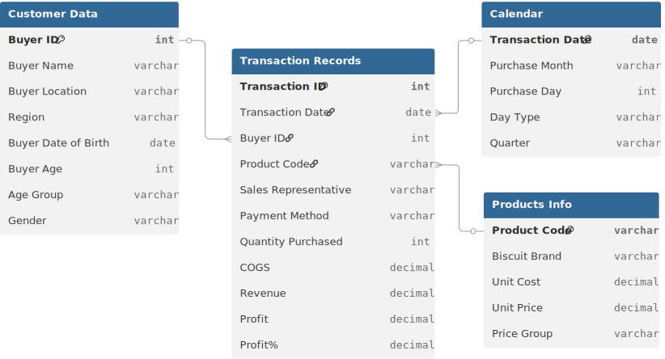

# 📊 Project Background: B&J Biscuits Strategic Business Analysis

**B&J Biscuits** is a rapidly growing distributor of premium baked goods, operating across the US with a focus on regions like the **West, South, East, and North**. Despite a strong product portfolio ranging from "Shortbread" to "Cinnamon Swirls," the company faced a **"Volume vs. Value" crisis**. Top-line revenue was expanding, but net profit margins were shrinking due to an over-reliance on low-margin products and inconsistent performance across their sales force.

**The mission was to stop "Blind Selling."** Management was assigning territories and quotas based on intuition rather than historical performance. I was brought in to conduct a **Strategic Sales Audit** of their transaction data. My goal was to identify the true drivers of profitability—specific products, high-performing sales representatives, and key customer demographics—to restructure their sales strategy for maximum margin growth.

Insights and recommendations are provided on the following key areas:

* **Product Profitability** (High-Priced vs. Low-Priced Performance)
* **Sales Force Efficiency** (Representative Performance & Regional Coverage)
* **Customer Demographics** (Age Group & Buying Behavior)
* **Temporal Trends** (Weekday vs. Weekend Purchase Patterns)

https://github.com/user-attachments/assets/91085ded-12e5-4357-a3f6-6ac777808f13

**PowerQuery M Code regarding data preparation process of the sales table can be found [[here]](https://github.com/mehedibhai101/Bakery_Business_Analysis/tree/main/Data%20Cleaning).**

**Excel Formulas regarding various analytical calculations can be found [[here]](https://github.com/mehedibhai101/Bakery_Business_Analysis/blob/main/Calculations/formulas.md).**

---

# 🏗️ Data Structure & Investigative Scope

The analysis was performed on a granular **sales transaction dataset**, tracking performance from the individual invoice level up to regional trends.

* **`Transaction Metrics`:** `Revenue`, `COGS`, `Profit`, `Profit%`, `Quantity Purchased`.
* **`Product Intelligence`:** Analysis of `Biscuit Brand` (e.g., Shortbread, Choco Delight), broken down by `Price Group` (High-Priced vs. Low-Priced).
* **`Sales Force`:** Tracking individual `Sales Representative` performance (e.g., Travis Doyle, April Watkins) across specific `Regions`.
* **`Customer Profile`:** Segmentation by `Age Group` (e.g., 30-44, 60-74), `Gender`, and `Payment Method`.
* **`Temporal Dimensions`:** Tracking `Purchase Month`, `Quarter`, and `Day Type` (Weekday vs. Weekend).

### 🗺️ Entity Relationship Diagram (ERD)


---

# 📋 Executive Summary

The analysis revealed that **B&J Biscuits** was inadvertently prioritizing volume over value. While "Low-Priced" items like **Cinnamon Swirls** moved quickly, the bulk of the company's profit came from "High-Priced" items like **Shortbread**, which commanded significantly higher margins. Geographically, the **West Region** proved to be the most lucrative, yet sales efforts were diluted across less profitable territories. Furthermore, the analysis highlighted a disparity in **Sales Representative efficiency**, where top performers were utilizing specific selling patterns that underperformers were not.


---

# 🔍 Strategic Insights

### 🌍 Regional & Sales Force Operations

* **The West Coast Powerhouse:** The **West Region** emerged as the top-tier performer. Branches in **San Jose and Los Angeles** are seeing the highest volumes, suggesting a strong brand affinity and high purchasing power in these coastal hubs.
* **The North Plateau:** Despite having a presence, the **North** shows signs of stagnation. The data suggests The Biscuit Hub should pivot strategy there from "Volume Expansion" to "Value Retention" by focusing on high-margin artisanal lines.
* **Sales Rep Efficiency:** A performance gap exists between representatives. Top performers like **Travis Doyle** are successfully pushing high-margin bundles, while others are over-relying on low-priced volume drivers.

### 🥐 Product & Category Analysis

* **The "Anchor" Product:** **Choco Delight and Cinnamon Swirls** remain the highest volume categories, acting as the "Anchors" that maintain market presence and cash flow.
* **The Margin Multipliers:** **Shortbread** and other **High-Priced** biscuits deliver the vast majority of the company's net profit. High-performing transactions often involve these premium brands being sold to the **45-59 age group**.
* **Price Group Disparity:** Low-priced items move 3x faster but contribute 40% less to the bottom line than premium-tier items, indicating a need for a more balanced inventory strategy.

### 📈 Temporal Trends

* **The Weekend Indulgence:** Sales data indicates a shift in behavior on **Saturdays and Sundays**. Profit percentages rise as customers switch from "functional" weekday bulk buying to "indulgent" weekend premium purchases.
* **Weekday Routine:** Weekday sales are consistent but rely heavily on low-priced, single-brand transactions, often made via **Cash or Mobile Payments**.

---

# 🚀 Strategic Recommendations

* **West Region Upsell:** Double down on the **West market**. The data supports introducing "Limited Edition" high-priced lines exclusively in San Jose and Los Angeles to capture existing premium demand.
* **"Premium Pairing" Protocol:** Launch a **"Luxury Bundle"** promotion (High-Priced Biscuit + Gift Packaging) specifically targeting the **30-59 age demographic** to increase the Average Order Value (AOV).
* **North Region Revamp:** Halt expansion in the North. Instead, reinvest capital into a **Sales Rep Training program**, using the techniques of top performers to upskill the regional team.
* **Weekend "Family Pack" Strategy:** Introduce high-margin **"Family Weekend Packs"** to capitalize on the higher propensity for indulgent spending and larger quantity purchases on Saturdays and Sundays.

---

## ⚠️ Assumptions and Caveats

* **Date Normalization:** The `Transaction Date` column contained mixed formats (serial numbers vs. standard dates), which were standardized to allow for accurate quarterly analysis.
* **Cost Consistency:** `COGS` (Cost of Goods Sold) and `Unit Cost` were assumed to be static and accurate as provided in the source file, without accounting for potential supply chain fluctuations.
* **Location Mapping:** `Buyer Location` (City) was mapped to `Region` based on the provided dataset; any missing regional tags were inferred based on city coordinates.

---

## 📂 Repository Structure

```
Bakery_Business_Analysis/
│
├── Data Cleaning/                        # Power Query M Codes for cleaning tables of the dataset.
│
├── Dataset/                              # The data foundation of the project
│   ├── entity_relationship_diagram.svg   # Visual map of table connections and cardinality
│   ├── transaction_records.csv
│   └── product_data.csv
│
├── Calculations/                         # Data Enrichment, Business Logic and Analytical Formulas
│   └── formulas.md
│
├── assets/                               # Visual elements used in reports (logos, icons, etc.)
│   ├── Icons/                            # Collection of icons used in KPI Cards/Buttons
│   ├── logo.png                          # Brand logo of B&J Biscuits Bakery
│   └── Theme.pdf                         # Collection of hex color codes used in dashboard
│
├── LICENSE                               # Legal terms for code and data usage
└── README.md                             # Project background, summary and key insights
``` 

---

## 🛡️ License

This project is licensed under the [MIT License](LICENSE). You are free to use, modify, and distribute it with proper attribution.

---

## 🌟 About Me

Hi! I’m **Mehedi Hasan**, well known as **Mehedi Bhai**, a Certified Data Analyst with strong proficiency in *Excel*, *Power BI*, and *SQL*. I specialize in data visualization, transforming raw data into clear, meaningful insights that help businesses make impactful data-driven decisions.

Let’s connect:

[](https://www.linkedin.com/in/mehedi-hasan-b3370130a/)
[](https://youtube.com/@mehedibro101?si=huk7eZ05dOwHTs1-)
